## 🚀 [GlowZ Dock]

      ___________                 __________      
     /  _____/|  |   ______  _  __\____    / 
    /   \  ___|  |  /  _ \ \/ \/ /  /     /     
    \    \_\  \  |_(  <_> )     /  /     /_     
     \______  /____/\____/ \/\_/  /_______ \    
            \/                            \/   
      _______                 __                               
      \_____ \   ____   ____ |  | __                           
      |     \ \ /  _ \_/ ___\|  |/ /                            
      |_____/  (  <_> )  \___|    <                             
      /______  /\____/ \___  >__|_ \                        
             \/            \/     \/ (Logo generated by Google A.I.)                    

      --- Developed by Suraween ---

##

## "GlowZ Dock (like in: Glossy Dock) is a dock to launch .exe, .lnk, and even Steam URLs in style on Windows 10/11!"

 

      Preview 
      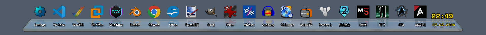
      Shutdown 
      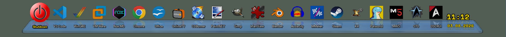
      Reboot 
      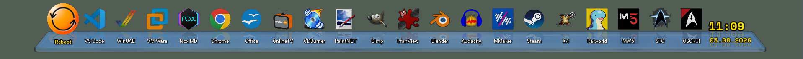
      Logout 
      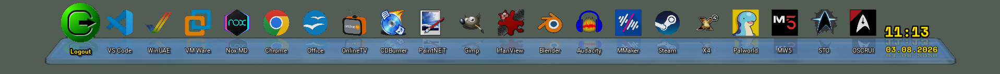
      No Calendar Preview 
      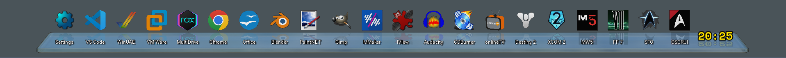
      No Clock Preview 
      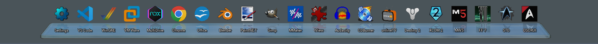
      Shadow Preview 
      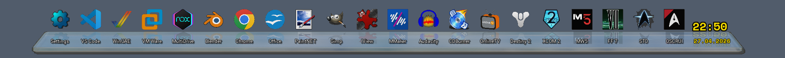
      RGB-Rainbow Pulse Preview 
      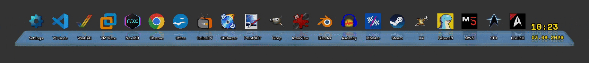
      Edit Menu Preview 
      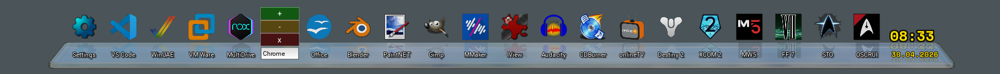
      Swapping Preview 
      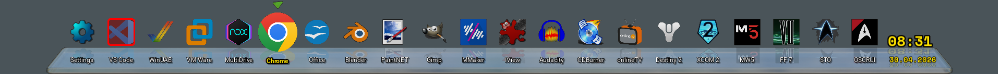
      Task-Menu Preview 
      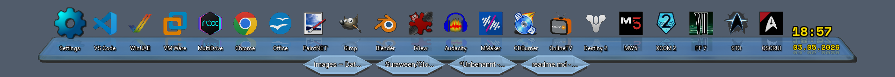
      Traymenu Preview 
      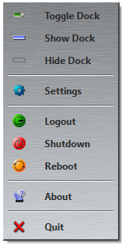

 

---
 
 

 
      GlowZ Dock Settings
       
      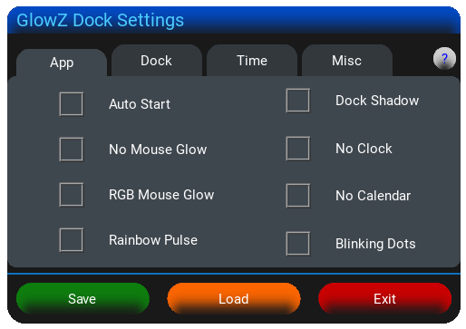
      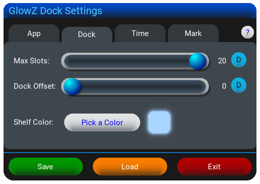
      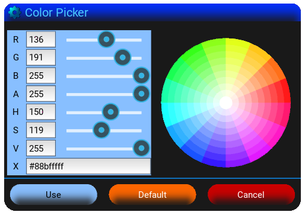
      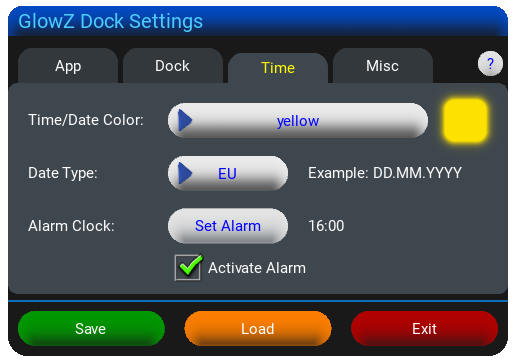
      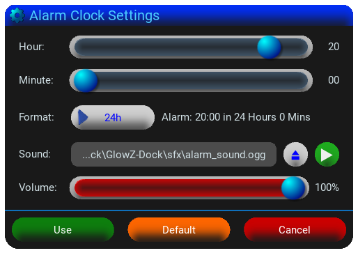
      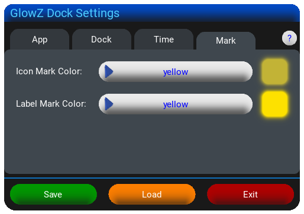

 

---

 

## 📥 Installation

**Download:**
1. Go to the **Releases** section.
2. Download `GlowZ Dock.zip` or `GlowZ_Dock_Setup.exe` from the latest release.

***Manual Install:***
- Extract the ZIP file and copy the contents to any folder you want to.

***Setup App:***
1. Start it
2. Select your directory or keep the Default -> Hit Next
3. Check on for Create Desktop -> Hit Next
4. Hit the Install
5. Done

**ATTENTION:** 
*Turn off your AntiVirus temporarily for the Installation and turn it back on after installation, for preventing issues!* 
*Ensure `GlowZ Dock.exe`, `GlowZ Dock Settings.exe`, and the `fonts` & `sfx` folders stay together!* 
***Important: Set system DPI scaling to 100%!*** 

 

## 🗑 Uninstall

**Manual:**
1. Open "GlowZ Dock Settings", uncheck "Autostart", and save.
2. Exit "GlowZ Dock".
3. Delete the "GlowZ-Dock" folder.
4. Delete the `.dock_cache` folder in your user directory.
5. Delete the "GlowZ-Dock" folder in `AppData\Roaming`.

**Windows:**
* **Standard Way:** Open the Windows **Settings** (`Win + I`) and go to **Apps** ➔ **Installed apps** (or **Apps & features** on Windows 10).
* **Power-User Way:** Press `Win + R`, type `appwiz.cpl` and hit Enter to open **Programs and Features**.
* **Action:** Search for **GlowZ Dock** in the list and click **Uninstall**.

 

## ⚠️ Important Note Regarding Antivirus Alerts (False Positives)

**Why is my antivirus (e.g., Windows Defender, Avast) triggering a warning?**

Because this application uses **Nuitka** to compile Python into native C-code, it may trigger false positives in antivirus software due to its structure, especially if the binary is unrecognized.

**Security & Integrity Guaranteed:**
- **100% Clean:** The code is safe and developed with White-Hat principles.
- **Safe to Whitelist:** You can safely add the `.exe` to your antivirus exclusions.
- **Full Transparency:** Verified VirusTotal links and SHA-256 checksums are provided in the release notes for confirmation.

 

## ✨ Features
- **App Launcher:** Imports `.exe`, `.lnk`, and Steam URLs including their respective icons.
- **Dynamic UI:** Customizable from 1 to 20 slots; automatically centered on screen (Default: 10).
- **Smart Taskbar Integration:** Stays on top of the taskbar, autodetects its position/visibility, and features an adjustable offset (0 or 50 pixels via slider).
- **Premium Aesthetics:** High-quality 3D graphics rendered in Blender, combined with transparent elements and silky-smooth animations.
- **Deep Customization:** Fully adjustable colors for the time/date, active labels/icons, and the dock itself (via built-in Color Picker).
- **System Features:**
  - Windows Auto Start support.
  - Toggleable dock shadow and eye-catching RGB-Rainbow Pulse effect.
- **Time & Calendar:**
  - Real-time clock with realistic reflections.
  - Left-click (LMB) opens the calendar (styled like the Windows taskbar).
  - Built-in Alarm Clock that automatically minimizes fullscreen apps/games, featuring customizable audio (`.mp3`, `.ogg`, `.wav`).
  - Supports ISO 8601, EU, and US datetime formats (includes tooltips with weekdays).
  - Optional blinking separator dot (Disabled by default).
- **Easy Management:**
  - Automatically scans for the next free slot from left to right. 
  - **Edit Menu (Shift + RMB):** Change icons, or rename labels *(Note: Labels are limited to 10 alphanumeric characters with Spaces)*. 
     - Add icons quickly via drag-and-drop or by left-clicking the `+` button.
     - Delete icon by left-clicking the `-` button.
     - Closing Edit-Menu by left-clicking the `x` button.
  - **Swap Slots (Ctrl + RMB or MMB):** Easily swap positions of two icons.
- **Advanced Control:**
  - **External Settings App:** Change slot count, screen offset, autostart, and visual effects easily.
  - **Quick Task-Menu:** Open instantly using the mouse scroll wheel while the dock is active (closes automatically after 5 seconds).
- **System-style popups** for notifications and confirmations.

***For new Features or Changes check out the Release Change-Logs***

 

## 🛠 Created with
* 🧊 **Blender** (3D Models, Rendering, Icon)
* 🎨 **Paint.NET** (2D Assets & Post-Processing)
* 🎹 **Magix Musicmaker 17 Pro** (Composing Alarm-Sound)
* 🖌️ **Greenfish Icon Editor Pro** (Icon editing)
* 💻 **VS Code** (Programming, Documentation)
* 💾 **Inno Setup** (Writing & compiling Setup.exe)
* 🧠 **Google A.I.** (Co-Piloting and writing Installation Script)
* 🌐 **Chrome** (Research)

 

## ✏️ Coded in:
- **Language:** Python
- **UI Framework:** Kivy
- **Co-Pilot:** Google A.I.
- **Compiler:** Nuitka (used to compile `.py` files into native `.exe` files instead of PyInstaller)

 

## 👤 Who made it & Contact
**Idea, Code, UI, Design, 2D/3D Graphics, Icon, Sfx and this File:**  
Suraween ([suraween.official@gmail.com](mailto:suraween.official@gmail.com))
 

**Installation Script:** 
Google A.I.

 

## ⚖️ Copyright
**GlowZ Dock and all its assets** is Copyright ©2026 by **Suraween**
 
[Space Mono Font](https://fonts.google.com/specimen/Space+Mono) is Copyright by Google  
 
*All Rights Reserved!*

 

## ⚠️ Disclaimer
90% of the code of **GlowZ Dock** and **GlowZ Dock Settings** is done by me (Suraween), the other 10% were Co-Piloted by Google A.I.,
all Graphics, Alarm-Sound, UI-Design and Features implemented were also done by myself (Suraween).

This software is provided "as is", without warranty of any kind.
The author is not responsible for any damage to your system, data loss, or issues caused by the use of this application. Use it at your own risk.

 

## 🕊️ Dedication
- **In memory of my beloved Mother** (passed away in 2016). Thank you for everything.
- **In memory of Ozzy Osbourne** (1948 - 2025). Thank you for the music, the Metal, and for inspiring me to pick up a guitar at age 3. You defined my attitude.
- **In memory of Jay Miner** (1932 - 1994). For the Amiga and the inspiration to be a coder, musician, and graphic artist. Once a Scener, always a Scener.

 

## 🗨️ Last Words
*I would like to sincerely thank all my Friends for their Love, Support, the Fun, and the Challenges! I Love you all! <3*
 

*A big thanks to Google and its A.I. for teaching me new stuff and Co-Piloting!*
 

*Thank YOU for downloading and using my "GlowZ Dock"!*
 

*I hope you liking it ;)*
