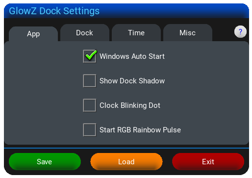
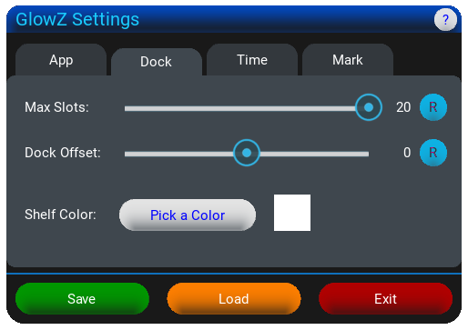
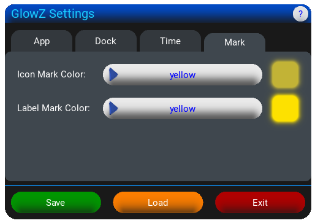

## 🚀 [GlowZ Dock]

      ___________                 __________      
     /  _____/|  |   ______  _  __\____    / 
    /   \  ___|  |  /  _ \ \/ \/ /  /     /     
    \    \_\  \  |_(  <_> )     /  /     /_     
     \______  /____/\____/ \/\_/  /_______ \    
            \/                            \/   
      _______                 __                               
      \_____ \   ____   ____ |  | __                           
      |     \ \ /  _ \_/ ___\|  |/ /                            
      |_____/  (  <_> )  \___|    <                             
      /______  /\____/ \___  >__|_ \                            
             \/            \/     \/                           

              - BY SURAWEEN -

---

## "GlowZ Dock (like in: Glossy Dock) is a dock to launch .exe, .lnk, and even Steam URLs in style on Windows!"

---

      Preview 
      
      No Calender Preview 
      
      No Clock Preview 
      
      Shadow Preview 
      
      RGB-Rainbow Pulse Preview 
      
      Edit Menu Preview 
      
      Swapping Preview 
      

 

---
 
 

 
      GlowZ Dock Settings
       
      
      
      
      
      

 

---

 

## 📥 Installation

1. Go to Releases..
2. Download "GlowZ Dock.zip".
3. Unpack and copy the content to any folder you like.
   
   **⚠️ Note: Some antivirus software (like Windows Defender) may flag the .exe files. This is a common "false positive" for unsigned Python-based executables.**
5. "GlowZ Dock" and "GlowZ Dock Settings", also the folders "fonts" & "gfx" must be in the same Folder, at all times to work properly!!!

## ✨ Features
- A dock that can import the .exe, .lnk and url for Steam and related Icons to run it
- From 1 to 20 Slots available, dynamic UI width - always centered (Default Numbers of Slots: 10)
- Is always on top of the Taskbar, autodetects taskbar position and visibility, with a -50, 0 or 50 pixel offset (via Slider)
- Modern Design in a 3D Graphic rendered with Blender
- Some handmade 2D Graphics
- Transparent Dock and Silky smooth animations
- Customization for some, like Colors of Time, Marked Label/Icons and the Dock itself.
*Dock via Color Picker and other with a Dropdown-Menu with a variety of prepared Colors*
- Quick and easy-to-use application
- Windows Auto Start
- Dock Shadow can be turn on or off
- RGB-Rainbow Pulse
- Real Reflections of Ikons, Clock & Calender
- Realtime Clock, LMB on it to open Calender (like: Windows-Taskbar)
- Adjustable Colors for Clock and Calender
- Blinking Dot (Disabled by Default)
  *Hint: RMB opens Time System Setting, MMB opens Outlook*
- Datetime: ISO 8601 (International Standard), EU & US (Also via Tooltip with Weekday)
- Add an Icon via LMB on the +-Icon or Drag&Drop
- Scans for next free Slot from Left to Right
- Edit a Slot with an Edit-Menu via RMB
  
   **You can change the App/Game and their Icon in Slots, remove them or rename the Labels**
  
   **Attention: Labels are limited to 10 alphanumeric characters (including spaces).**
- Swap 2 Icons with the MMB also with some nice Animations
- External Settings App for changing the Numbers of Slots, Offset from the bottom of the Sceen,
  Windows Auto Start, Start RGB-Rainbow Pulse or Dock-Shadow.
  
  **You can run the Settings by clicking on the very 1st Icon from the left with LMB,**
  **or open the About-Popup via RMB**
  
- System-style popups for confirmations and notifications.

## 🛠 Created with
* 🧊 **Blender** (3D Models, Rendering, Icon)
* 🎨 **Paint.NET** (2D Assets & Post-Processing)
* 🖌️ **Greenfish Icon Editor Pro** (Icon editing)
* 💻 **VS Code** (Programming, Documentation)
* 🌐 **Chrome** (Research)

## ✏️ Coded in:
   Python and Kivy (UI Framework)
   PyInstaller was used to compile .py files into .exe files.

## 👤 Who made it & Contact
**Idea, Code, UI, Design, 2D/3D Graphics, Icon and this File:**  
Suraween ([suraween@yahoo.de](mailto:suraween@yahoo.de))

## ⚖️ Copyright
**GlowZ Dock** is Copyright ©2026 by **Suraween**  
[Space Mono Font](https://fonts.google.com/specimen/Space+Mono) is Copyright by Google  

*All Rights Reserved!*

## ⚠️ Disclaimer
This software is provided "as is", without warranty of any kind.
The author is not responsible for any damage to your system, data loss, or issues caused by the use of this application. Use it at your own risk.

## 🕊️ Dedication
- **In memory of my beloved Mother** (passed away in 2016). Thank you for everything.
- **In memory of Ozzy Osbourne** (1948 - 2025). Thank you for the music, the Metal, and for inspiring me to pick up a guitar at age 3. You defined my attitude.
- **In memory of Jay Miner** (1932 - 1994). For the Amiga and the inspiration to be a coder, musician, and graphic artist. Once a Scener, always a Scener.

## 🗨️ Last Words
I would like to sincerely thank all my Friends for their Love, Support, the Fun, and the Challenges! I Love you all! <3

**Thank YOU for downloading my "GlowZ Dock"!**

*i hope you liking it!*

 

---
 
 

 
      GlowZ Dock Settings
       
      
      
      
      

 

---

 

## 📥 Installation

1. Go to Releases..
2. Download "GlowZ Dock.zip".
3. Unpack and copy the content to any folder you like.
   
   **⚠️ Note: Some antivirus software (like Windows Defender) may flag the .exe files. This is a common "false positive" for unsigned Python-based executables.**
5. "GlowZ Dock" and "GlowZ Dock Settings", folder "fonts" & "gfx" must be in the same Folder, at all times to work properly!!!

## ✨ Features
- A dock that can import the .exe, .lnk and url for Steam and related Icons to run it
- From 1 to 20 Slots available, dynamic UI width - always centered (Default Numbers of Slots: 10)
- Is always on top of the Taskbar, autodetects taskbar position and visibility, with a -50, 0 or 50 pixel offset (via Slider)
- Modern Design in a 3D Graphic rendered with Blender
- Some handmade 2D Graphics
- Transparent Dock and Silky smooth animations
- Customization for some, like Colors of Time, Marked Label/Icons and the Dock itself.
*Dock via Color Picker and other with a Dropdown-Menu with a variety of prepared Colors*
- Quick and easy-to-use application
- Windows Auto Start
- Dock Shadow can be turn on or off
- RGB-Rainbow Pulse
- Real Reflections of Ikons, Clock & Calender
- Realtime Clock, LMB on it to open Calender (like: Windows-Taskbar)
- Adjustable Colors for Clock and Calender
- Blinking Dot (Disabled by Default)
  *Hint: RMB opens Time System Setting, MMB opens Outlook*
- Datetime: ISO 8601 (International Standard), EU & US
- Add an Icon via LMB on the +-Icon or Drag&Drop
- Scans for next free Slot from Left to Right
- Edit a Slot with an Edit-Menu via RMB
  
   **You can change the App/Game and their Icon in Slots, remove them or rename the Labels**
  
   **Attention: Labels are limited to 10 alphanumeric characters (including spaces).**
- Swap 2 Icons with the MMB also with some nice Animations
- External Settings App for changing the Numbers of Slots, Offset from the bottom of the Sceen,
  Windows Auto Start, Start RGB-Rainbow Pulse or Dock-Shadow.
  
  **You can run the Settings by clicking on the very 1st Icon from the left with LMB,**
  **or open the About-Popup via RMB**
  
- System-style popups for confirmations and notifications.

## 🛠 Created with
* 🧊 **Blender** (3D Models, Rendering, Icon)
* 🎨 **Paint.NET** (2D Assets & Post-Processing)
* 🖌️ **Greenfish Icon Editor Pro** (Icon editing)
* 💻 **VS Code** (Programming, Documentation)
* 🌐 **Chrome** (Research)

## ✏️ Coded in:
   Python and Kivy (UI Framework)

## 👤 Who made it & Contact
**Idea, Code, UI, Design, 2D/3D Graphics, Icon and this File:**  
Suraween ([suraween@yahoo.de](mailto:suraween@yahoo.de))

## ⚖️ Copyright
**GlowZ Dock** is Copyright ©2026 by **Suraween**  
[Space Mono Font](https://fonts.google.com/specimen/Space+Mono) is Copyright by Google  

*All Rights Reserved!*

## ⚠️ Disclaimer
This software is provided "as is", without warranty of any kind.
The author is not responsible for any damage to your system, data loss, or issues caused by the use of this application. Use it at your own risk.

## 🕊️ Dedication
- **In memory of my beloved Mother** (passed away in 2016). Thank you for everything.
- **In memory of Ozzy Osbourne** (1948 - 2025). Thank you for the music, the Metal, and for inspiring me to pick up a guitar at age 3. You defined my attitude.
- **In memory of Jay Miner** (1932 - 1994). For the Amiga and the inspiration to be a coder, musician, and graphic artist. Once a Scener, always a Scener.

## 🗨️ Last Words
I would like to sincerely thank all my Friends for their Love, Support, the Fun, and the Challenges! I Love you all! <3

**Thank YOU for downloading my "GlowZ Dock"!**

*i hope you liking it!*
