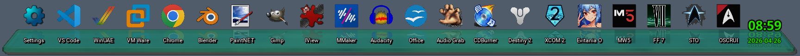
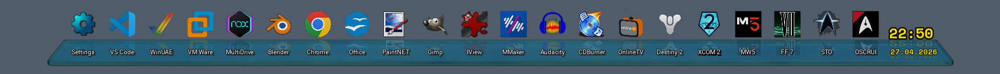
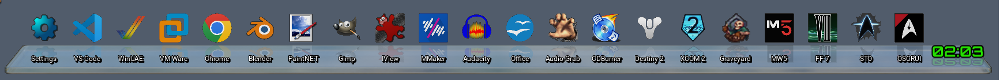

## 🚀 [GlowZ Dock]

      ___________                 __________      
     /  _____/|  |   ______  _  __\____    / 
    /   \  ___|  |  /  _ \ \/ \/ /  /     /     
    \    \_\  \  |_(  <_> )     /  /     /_     
     \______  /____/\____/ \/\_/  /_______ \    
            \/                            \/   
      _______                 __                               
      \_____ \   ____   ____ |  | __                           
      |     \ \ /  _ \_/ ___\|  |/ /                            
      |_____/  (  <_> )  \___|    <                             
      /______  /\____/ \___  >__|_ \                            
             \/            \/     \/                           

              - BY SURAWEEN -
---
"GlowZ Dock (like in: Glossy Dock) is a dock to launch .exe, .lnk, and even Steam URLs in style on Windows!"
---

      Without RGB-Rainbow Pulse
      
      With RGB-Rainbow Pulse
      
      No Shadow Preview
      

## 📥 Installation

1. Go to Releases..
2. Download "GlowZ Dock.zip".
3. Unpack and copy the content to any folder you like.
   **⚠️ Note: Some antivirus software (like Windows Defender) may flag the .exe files. This is a common "false positive" for unsigned Python-based executables.**
4. "GlowZ Dock" and "GlowZ Dock Settings" must be in the same Folder, at all times to work properly!!!

## ✨ Features
- A dock that can import the .exe, .lnk and url for Steam and related Icons to run it
- From 1 to 20 Slots available, dynamic UI width - always centered
- Is always on top of the Taskbar, autodetects taskbar position and visibility
- Modern Design in a 3D Graphic rendered with Blender
- Some handmade 2D Graphics
- Transparent Dock and Silky smooth animations
- Customizability
- Quick and easy-to-use application
- Auto Start
- Dock Shadow can be turn on or off
- RGB-Rainbow Pulse
- Real Reflections of some Assets
- Realtime Clock, click on it to open Calender (like: Windows-Taskbar)
- Add an Icon via LMB on the +-Icon or Drag&Drop
- Scans for next free Slot from Left to Right
- Edit a Slot with an Edit-Menu via RMB
   *Attention: Labels are limited to 10 alphanumeric characters (including spaces).*
- Swap 2 Icons with the MMB also with some nice Animations
- System-style popups for confirmations and notifications.

## 🛠 Created with
* 🧊 **Blender** (3D Models & Rendering)
* 🎨 **Paint.NET** (2D Assets & Post-Processing)
* 💻 **VS Code** (Programming, readme.md)
* 🌐 **Chrome** (Research & Documentation)

## ✏️ Coded in:
   Python and Kivy (UI Framework)

## 👤 Who made it & Contact
**Idea, Code, UI and Design:**  
Suraween ([suraween@yahoo.de](mailto:suraween@yahoo.de))

## ⚖️ Copyright
**GlowZ Dock** is Copyright ©2026 by **Suraween**  
[Orbitron Font](https://fonts.google.com/specimen/Orbitron) is Copyright by Google  

*All Rights Reserved!*

## ⚠️ Disclaimer
This software is provided "as is", without warranty of any kind.
The author is not responsible for any damage to your system, data loss, or issues caused by the use of this application. Use it at your own risk.

## 🕊️ Dedication
- **In memory of my beloved Mother** (passed away in 2016). Thank you for everything.
- **In memory of Ozzy Osbourne** (1948 - 2025). Thank you for the music, the Metal, and for inspiring me to pick up a guitar at age 3. You defined my attitude.
- **In memory of Jay Miner** (1932 - 1994). For the Amiga and the inspiration to be a coder, musician, and graphic artist. Once a Scener, always a Scener.

## 🗨️ Last Words
I would like to sincerely thank all my friends for their support, the fun, and the challenges!!!
Thank YOU for downloading my "GlowZ Dock", i hope you liking it!!!
